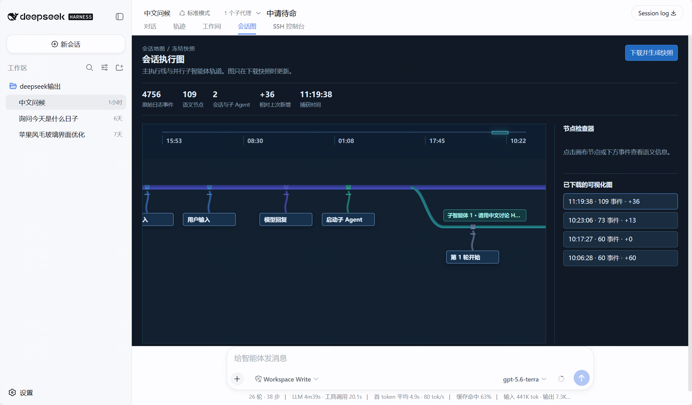
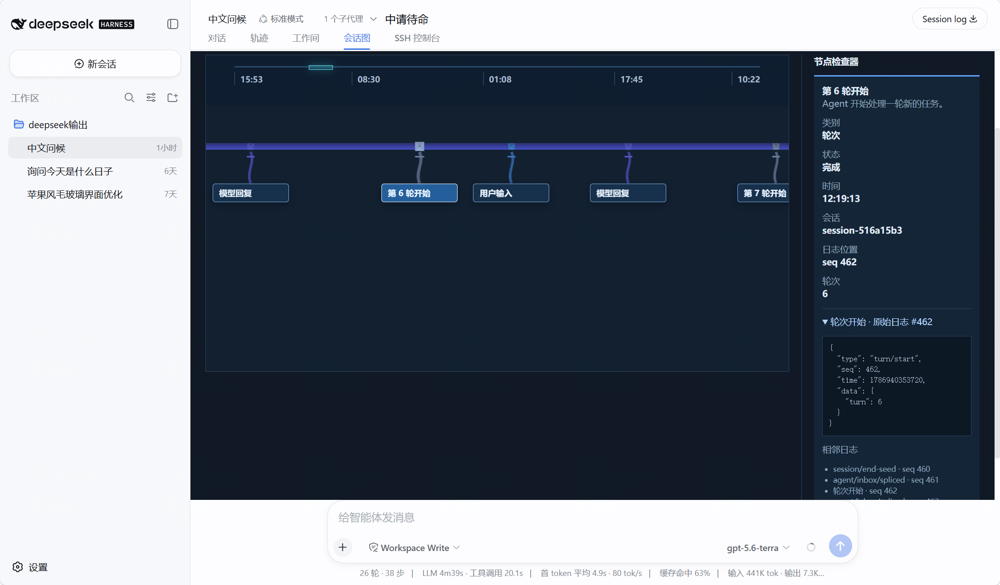
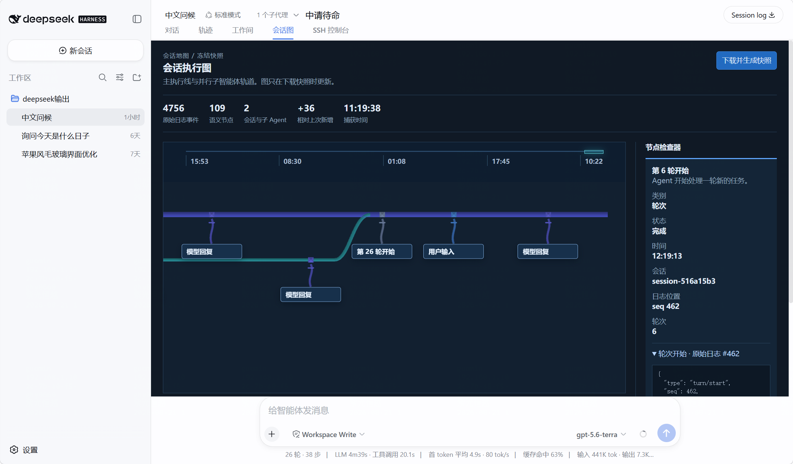

# DSH Session Map

`dsh-seelog` 是 DeepSeek Harness 的外部 Web 插件。它按需读取当前 Session Log 并转换为可浏览的会话执行图：主 Agent 是一条 3D 主线，子 Agent 从实际启动位置分叉并在结束处汇回；节点、时间和原始日志仍可逐一追溯。

插件仅以 bundle 方式加载，不会修改 DeepSeek Harness 的源码、会话格式或 Agent 循环。



## 能解决什么问题

- 将输入、模型回复、工具调用、轮次、失败和子 Agent 映射为中文语义节点，而不是直接展示 JSON。
- 将子 Agent 与主 Agent 放在同一时间坐标中。子 Agent 从创建时间对应的主线节点分叉，避免平铺列表混淆父子关系。
- 进入视图时读取一次当前日志；结束横向拖动后再读取一次，因此能看到新进展而不持续实时轮询。
- 通过顶部概览尺快速跳转到任意时间段；主图保持可拖拽和滚轮横移。
- 点击节点后按需读取该事件及相邻日志，避免在初始图中泄露或堆叠大量原始内容。

## 界面组成

### 固定时间概览尺

主图顶部的时间概览始终映射整个已捕获会话，不随主图横向移动。它只显示有限且均匀分布的时间刻度，避免标签重叠。

- 青色窗口表示当前主图可见范围。
- 点击某个刻度，或点击概览轨道上的位置，主图会平滑定位到对应时间。
- 概览尺是导航控件，不替代主图中的详细节点。

### 主执行线与绳结标签

紫色粗线表示根会话的执行顺序。每个语义节点在主线上形成一个菱形绳结，绳结通过垂线连接到中文标签卡片。标签和主线共享同一个平移位置，因此横移时两者不会错位。

常用颜色含义：

- 蓝色：用户输入。
- 紫色：模型回复与轮次。
- 青绿色：工具调用或子 Agent 轨道。
- 红色：实际失败事件。正常工具调用不会显示为错误。

### 子 Agent 分叉

子 Agent 使用独立的青绿色轨道：从主线中实际创建它的位置离开，显示自身事件后再回到主线。这样可同时观察父子关系与时间顺序。


### 节点检查器

点击主线、子 Agent 轨道或中文标签后，右侧检查器显示该节点的语义名称、类别、状态、时间、会话、日志序号、轮次和耗时。展开原始日志后可以查看完整 JSON 与相邻事件。



选中的节点会被高亮；图不会跳回开头，而是保留当时的横向视口位置。



## 使用方法

### 1. 安装到 Web profile

在插件目录安装依赖并构建：

```powershell
cd D:\harness-lh-int8\dsh-seelog
npm install
npm run validate
```

将外部插件链接到运行 Web UI 的 DSH profile：

```powershell
dsh plugin --profile web add D:\harness-lh-int8\dsh-seelog
dsh --profile web --dump-config
```

重启该 profile 后，任意会话的标签栏会出现 `会话图`。

### 2. 打开当前会话图

1. 打开一个会话并切换到 `会话图`。
2. 插件自动读取一次当前 Session Log，并生成主线、子 Agent 分支、概览尺和中文节点标签。
3. 主图拖动结束后，插件再请求一次当前日志，将新增的会话事件纳入图中。

插件不进行轮询，也不保存下载历史。页面保持当前图，直到你重新进入视图或结束一次主图拖动。

### 3. 浏览执行过程

| 操作 | 结果 |
| --- | --- |
| 点击顶部概览尺 | 跳转主图到所选时间附近。 |
| 鼠标放在主图上滚轮 | 水平移动主图。 |
| 左键按住主图拖动 | 像抓手一样平移主图。 |
| 松开拖动后的主图 | 按需刷新当前 Session Log，再显示新的执行事件。 |
| 点击节点或节点卡片 | 高亮节点，并在检查器加载语义信息和原始日志。 |
| 点击子 Agent 轨道 | 观察它从主线分出、执行并汇回的位置。 |

## 中文语义映射

插件会将常用工具和事件转换为中文，例如 `web_search` 显示为“网页搜索”，`apply_patch` 显示为“应用补丁”，`WEB_PROVIDER_CREDENTIAL_MISSING` 显示为“未配置网页服务凭据”。

未知工具不会直接用英文占满图；它们显示为“工具调用”或“MCP 工具调用”。完整工具标识和原始字段保留在节点检查器中，方便调试。

## 数据、隐私与限制

- 会话图投影只包含轻量语义字段，不包含模型正文、提示词或工具参数。
- 只有在点击某个节点后，浏览器才请求该事件及其前后两条原始日志。
- 不保存浏览器本地快照历史；离开或刷新页面后会重新按需读取当前日志。
- `cordis.patch.yml` 默认最多读取 128 个谱系会话、每个会话最多 20,000 条日志事件。
- 为保障大日志会话的浏览性能，每条轨道最多绘制 400 个交互节点，同时保留输入、模型回复、失败、端点和代表性工具事件。

会话图使用插件自己的只读路由读取日志，不依赖 DSH 原生 `Session log` 下载按钮，也不会更改会话日志。

## 开发与更新

```powershell
npm run typecheck
npm test
npm run bundle
```

本地迭代后重启 Web profile，并在浏览器中使用 `Ctrl+F5` 强制刷新。Web 客户端已加载的插件模块不会因文件变化自动替换。

## 故障排查

- `会话图` 标签没有出现：确认已执行 `dsh plugin --profile web add ...`，然后重启 profile。
- 页面仍是旧布局：重启 Web profile 后使用 `Ctrl+F5`。
- 节点检查器没有原始日志：确认会话仍在本地 durable log 中，且节点的 `seq` 可读取。
- 主图无法继续横移：当前会话图的可见宽度已经覆盖整个会话；用顶部概览尺可以确认当前范围。

## 许可

MIT。Three.js 以 MIT 许可随客户端 bundle 分发。
